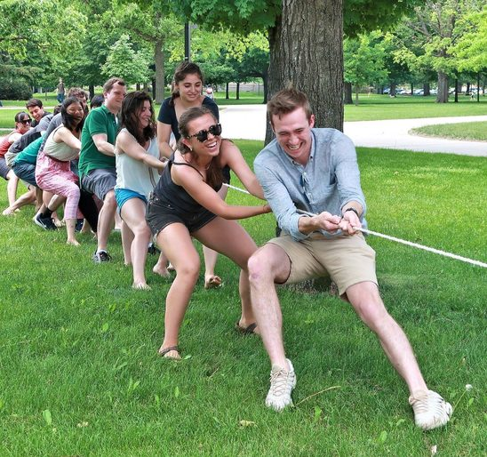
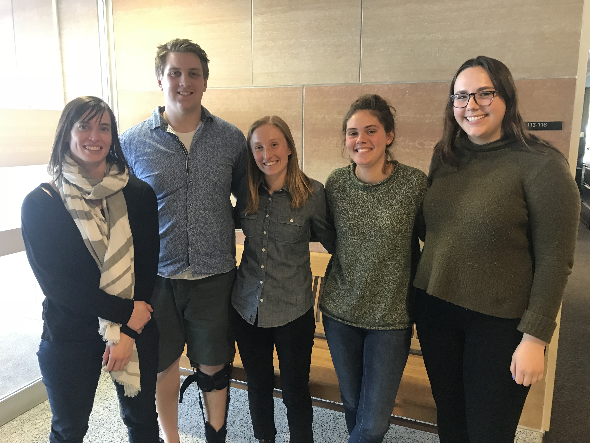

```{r setup, include=FALSE}
options(htmltools.dir.version = FALSE)
knitr::opts_chunk$set(collapse=TRUE, prompt=TRUE, comment=NULL, message = FALSE, warning = FALSE, dev = 'svg')
```


.left-column[

]

.right-column[
### My trajectory

- BS (1999) Math from the University of MN Duluth

- PhD (2004) Statistics from the University of MN 

- Colby College 2004-2007
  - Assistant Professor

- Carleton College 2007-
  - Associate Professor of Statistics
  - Department of Mathematics and Statistics 
  - Chair (since July 1!)
  

]


---


background-image: url(images/lakes.jpg)


---


.left-column[

]

.right-column[
### Carleton College


- Northfield, MN
  - 45 minutes south of MSP

- Liberal arts college 

-  2,000 undergrads from around the US and abroad
  - very few (if any) students outside the 18-22 age range

- student-to-faculty ratio of 9:1
  
- in Stats: class sizes between 20-35
  

]

---

.left-column[

]

.right-column[
### Department of Mathematics and Statistics

- Faculty: 
  - 4 statisticians
  - 9 mathematicians
  - 1 continuing faculty and 3-4 visitors/year
  
- Two majors: 
  - Statistics: 40 juniors/seniors
  - Mathematics: 90 juniors/seniors

- One minor:
  - Mathematics: 13

]
---
.left-column[

]

.right-column[
### Teaching at a liberal arts college

- High quality **undergrad** teaching is expected

  - At Carleton, we get strong support from the Administration
  
- Strong students 

  - often have broad academic interests
  
  - but math/stat background can vary

]

---
.left-column[

]

.right-column[
### Teaching at a liberal arts college
- Building a math/stat community is important

  - faculty are accessible to students outside of class
  
  - help with internship/career/grad school advice, letters of recommendation
  
  - engage in social events
  


.footnote[Stat vs. Math tug of war]

]


---

.left-column[

]

.right-column[
### Who we teach at Carleton


- Our statistics majors

- Students seeking

  - a distribution requirement (a "quantitative reasoning" course)
  
  - a prerequisite for a methods class (e.g. econ, poli sci)

- Non-majors wanting to enhance their stats/data science knowledge

- These groups are not mutually exclusive

]


---
.left-column[

]

.right-column[
### What we teach at Carleton

- Intro Stats: Lock^5-level 

- Core Major Courses: Probability and Intro to Inference (Math/Stat)

- "Second" Course: Applied Regression,  Data Science 

- Electives: usually every other year
  -  Intro to Sampling
  - Time Series  
  - Advanced Modeling
  - Bayesian Stats

- Statistical Consulting
]

---

.left-column[

]

.right-column[
### Teaching load at Carleton

- 5 courses/year 

  - Our academic year has three 9.5-week terms (fall, winter, spring)
  
  - *usually* balanced between Intro and non-Intro courses 
  
  - *usually* elective every other year

  - *usually* have a homework grader but not TAs
]

  
---


.left-column[


]

.right-column[
### Research with students at Carleton

- Most years I run a "senior comprehensive" project (capstone course)

  - group of 4-6 senior stat majors, 2 terms
  

- Carleton also provides summer funding for **students** doing research with faculty

  


.footnote[Me, Nick Fredrickson, Emily Kaegi, Alana Danieu, Clara Livingston]
]
---


.left-column[

]

.right-column[
### Research expecations (for tenure)

- Need to demonstrate a commitment to scholarship and intellectual growth

  - no quota on production
  
  - may also include pedagogy and student research, consulting, package development
  
  - make sure mathematicians understand what statistics scholarship looks like
  


]


---


.left-column[

]

.right-column[
### Service on Campus


- Departmental:
  - weekly meeting
  - hiring committees
  - "chores"

- College-wide:
  - faculty meetings
  - committee meetings
  - student advising: 10-16 advisees

- "Consulting":
  - advice for students doing comps
  - advice for faculty research ("free")
  - supporting campus-wide interest in stats/DS/R 


]
---

.left-column[

]

.right-column[
### Promotion

- Tenure-track candidates are evaluated on
  - teaching: most important!
  
  - scholarship/research
  
  - service: on campus and the broader statistics/data science community

- Timeline at Carleton

  - Third-year review
  
  - Tenure review (~6-7 years)
  
  - Full professor
]

---


.left-column[

]

.right-column[
### Support for teaching

- Get teaching support and advice from your wider campus community

  - at Carleton: the  Learning and Teaching Center 

- Use mentors inside and outside your department

- Engage with any "junior" faculty groups on campus

  - at Carleton: Junior Faculty Affairs Committee

- Get involved with the SSDSE community

]


---


.left-column[

]

.right-column[
### What would hiring for your job look like today?

- Timing: 
  - late fall - mid winter
  
  - some informal meetings/announcements at JSM
  
- Application

  - Cover
  
  - CV
  
  - Teaching Statement
  
  - Research Statement (for tenure-track)
  
  - Diversity Statement (formal statement is optional)

]
---


.left-column[

]

.right-column[
### Strong applications... 

- avoid a generic cover
    - why you want to be at a liberal arts school? 
    
    - highlight knowledge of Carleton 

]

---


.left-column[

]

.right-column[
### Strong applications... 


- have a thoughtful  teaching statement

    - how will you engage *all* students?
    
    - create a welcoming/inclusive environment?
    
    - how will you help increase diversity in our department/majors?
    
    - talk both about your experience and potential for growth
]
---


.left-column[

]

.right-column[
### Strong applications... 

- have research statements that addresses both current and future scholarship plans 

    - how will you stay active if you are an "isolated" statistician?

    - is your research accessible to undergrads?  
        - do you have ideas for UG projects?


]

---


.left-column[

]

.right-column[
### Rewards 
What are the rewarding aspects of your job?

- Students
    - Overenrolled courses (everyone wants stats/data science!)

    - mentoring curious students with great attitudes (mostly!)

- Colleagues

    - working with people who value and *support* teaching 
    
    - helping guide curriculum and program development


]


---


.left-column[

]

.right-column[
### Challenges

What are the challenges of your job?

- Overenrolled courses (everyone wants stats/data science!)

- Being one of a few statisticians in a department

- Everyone wants to fit statistical models and analyze data

    - but should they? 


]


---


.left-column[

]

.right-column[
### Rewarding Challenges

What are the rewarding challenges of your job?

- data science.

- how to have productive classroom discussions of ethics in statistics/data science

- how to increase diversity in both faculty and students


]

---


.left-column[

]

.right-column[
### Thanks for listening!

- kstclair@carleton.edu

- slides: https://kstclair.github.io/JSM_2020/slides.pdf

- [https://www.carleton.edu/math/](https://www.carleton.edu/math/)

]